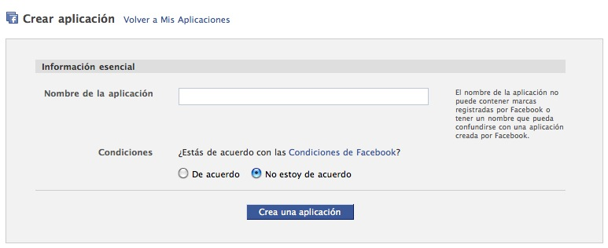

!SLIDE
#¿Qué es una aplicación de Facebook?#

Es una aplicación web <strong>completamente normal</strong>, que se pinta dentro de FB. Tenemos que publicarla en un servidor e indicarle la URL para recogerla. La parseará, reemplazará algunos elementos y la integrará.

Pueden ser:

* Públicas (no requieren que el usuario esté autenticado en FB)
* Privadas (requieren autenticación)

!SLIDE subsection
#En www.facebook.com/developer#

Creamos una nueva aplicación mediante el botón de la parte superior derecha.

