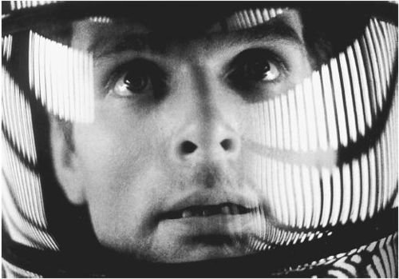

!SLIDE subsection
#El setup de la aplicación en el servidor (local)#

!SLIDE bullets incremental center small

#Necesitaréis:#

* Servidor LAMP
* Un cliente Git
* Una cuenta activa en Facebook
* Agregar a <strong>Dave Bowman</strong> (buscad <strong>x@season.es</strong>)
* Ir a <strong>www.facebook.com/developers</strong>
* Sentido del humor. En serio.

!SLIDE commandline incremental
#El código:#

##Para los que no usáis Git:###
##**http://github.com/victorcoder/ninja_moves**##
###(Descomprimid y copiad los ficheros en vuestro DocRoot)###

##Los que si (hay dos tipos de personas)##

    $ git clone git://github.com/victorcoder/ninja_moves.git

!SLIDE commandline incremental

#Carga del schema de la BD#

    $ cd app
    $ ../cake/console/cake bake schema create

!SLIDE

#Comprobad que funciona#

##**http://localhost/ninja_moves**##

!SLIDE
#¿Lo tenéis todo?#
###Mientras hacéis el setup, agregáis a Dave y comprobáis que todo funciona, os daremos un poco la chapa con un par de cosas generales que debéis saber a la hora de desarrollar apps de Facebook.###